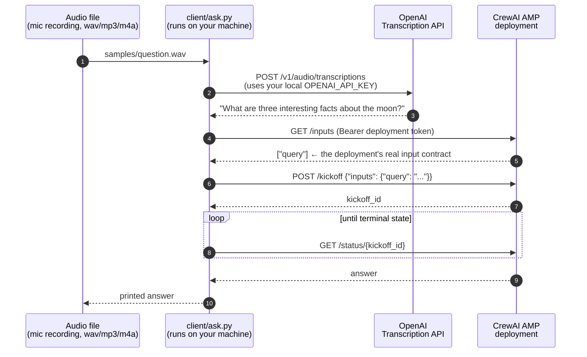

# crewai-audio-quickstart

Minimal reference: **audio → OpenAI transcription → CrewAI deployment kickoff → answer.**

Speak a question into an audio file, and a crew deployed on [CrewAI AMP](https://app.crewai.com)
answers it. The crew here is deliberately tiny (one agent that answers a question) —
the point of this repo is the **wiring**, which works the same for any crew or flow
that takes text input.

## Architecture



**Where credentials live (and don't):**

| Step | Credential | Where it lives |
|---|---|---|
| Speech-to-text (client) | `OPENAI_API_KEY` | Your machine only — env var, `.env`, or `~/.openai-key`. Never committed. |
| Crew's LLM calls (server) | `OPENAI_API_KEY` | Set once as an **environment variable on the AMP deployment** — stored on the platform, never in the repo. Orgs that want centralized key management can back deployment env vars with AMP's [Secrets Manager](https://docs.crewai.com/en/enterprise/features/secrets-manager/overview). |
| Kickoff API | deployment URL + bearer token | Shown on the deployment's page in AMP. Each deployment has its own. |

Nothing secret ever lives in this repository — the deployment's key sits in AMP's
env-var store, and the client's key stays on your machine.

## Repo layout

```
src/audio_quickstart/   the crew: one agent, one task, input {query}
client/ask.py           audio → transcript → kickoff → answer (stdlib only)
scripts/make_sample_audio.sh   synthesize a test question with macOS `say`
samples/question.wav    a ready-made spoken question
```

## Prerequisites

- A [CrewAI AMP](https://app.crewai.com) account.
- An OpenAI API key — used in two places, both outside this repo: as an env var
  on the AMP deployment (for the crew's LLM calls) and on your machine (for the
  transcription call).
- Python 3.10+ (the client is stdlib-only; no `pip install` needed to run it).
- [uv](https://docs.astral.sh/uv/) and the [CrewAI CLI](https://docs.crewai.com/en/concepts/cli)
  if you want to run or modify the crew locally.

## 1. Deploy the crew to AMP

Fork/clone this repo into your own GitHub account or org, then in
[CrewAI AMP](https://app.crewai.com): **Deployments → Create Deployment**, pick this
repository (root directory), add one environment variable — `OPENAI_API_KEY` — and
deploy. The key is stored on the platform with the deployment; it never appears in
the repo.

Or from the terminal, with the CLI authenticated (`crewai login`) and the key in a
local `.env` (the CLI reads it from there and registers it with the deployment):

```bash
crewai deploy create   # run inside the repo
crewai deploy status   # wait for "Deploy Enqueued" → online
```

When it's online, the deployment's page shows its **URL** and **bearer token**.
Copy both:

```bash
cp .env.example .env   # then fill in the values
```

## 2. Run the client end-to-end

```bash
# no assets needed — synthesize a spoken question (macOS):
./scripts/make_sample_audio.sh "What are three interesting facts about the Moon?"

python3 client/ask.py samples/question.wav
```

Expected output:

```
1) transcribing samples/question.wav with gpt-4o-transcribe ...
   transcript: 'What are three interesting facts about the moon?'
2) discovering the deployment's input contract (GET /inputs) ...
   required inputs: ['query']
3) kicking off with inputs: {"query": "What are three interesting facts about the moon?"}
   kickoff_id: 01234567-89ab-cdef-0123-456789abcdef
4) polling for the result ...
   state: RUNNING
   state: SUCCESS

answer:
The Moon is Earth's only natural satellite ...
```

Any wav/mp3/m4a recording works — record a voice memo and pass its path.

## Run the crew locally (optional)

```bash
export OPENAI_API_KEY=sk-...   # locally there's no platform connection, so a key IS needed
uv run run_crew "Why is the sky blue?"
```

## Troubleshooting the kickoff API

The five foot-guns, in the order people usually hit them:

1. **Wrong base URL or token → 401/403.** Every deployment has its **own** URL and
   its **own** bearer token — both from that deployment's page in AMP. A token from
   another deployment (or an org/user token from somewhere else) will not work.

2. **Assumed input key names → 422.** Never guess the inputs. Ask the deployment:

   ```bash
   curl -H "Authorization: Bearer $CREWAI_DEPLOYMENT_TOKEN" "$CREWAI_DEPLOYMENT_URL/inputs"
   # {"inputs": ["query"]}
   ```

   Send **exactly** those keys. A classic failure: sending `session_id` when the
   flow expects `id` → 422. (`python3 client/ask.py --show-inputs` does the same.)

3. **Forgot the `inputs` wrapper → 422.** The kickoff body is
   `{"inputs": {"query": "..."}}`, not `{"query": "..."}`.

4. **Truncated UUID → 422.** If your crew/flow takes a session or run id, it must be
   a **full, valid UUID** (`str(uuid.uuid4())`). Never shorten it for readability.

5. **Polling too literally.** `/status/{kickoff_id}` moves through states like
   `PENDING → RUNNING → SUCCESS` (exact names can vary by version). Treat any of
   `SUCCESS/COMPLETED` as done and `FAILED/ERROR` as failed, rather than matching
   one exact string — see `wait_for_answer()` in `client/ask.py`.

## Adapting this to your own crew

Point `CREWAI_DEPLOYMENT_URL`/`CREWAI_DEPLOYMENT_TOKEN` at any deployment. The
client discovers the input contract at runtime, drops the transcript into the text
input, and auto-fills any `*_id` inputs with fresh UUIDs. If your deployment's
inputs are more elaborate, adjust `build_inputs()` in `client/ask.py` — everything
else stays the same.
